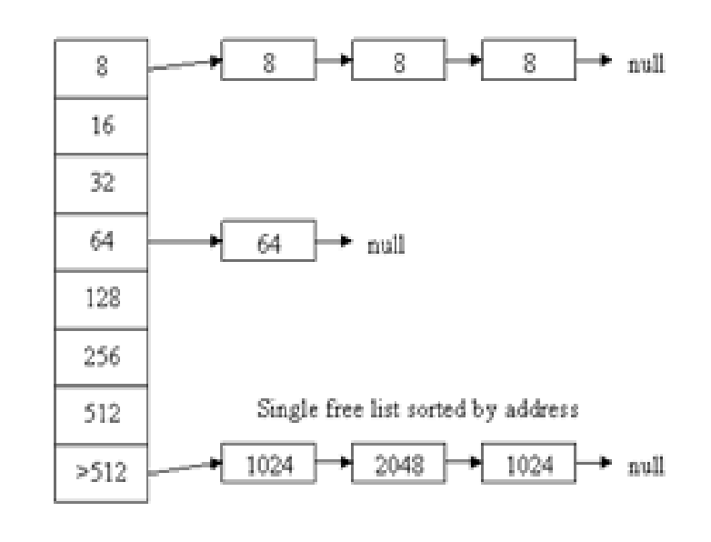

# C++ Memory Manager.
## Advance C++ course - 3rd assignment.

#### Introduction:
Using dynamic memory allocation in your application(malloc, free, new, delete),  
addresses the OS's kernel in requests for the memory allocation and release.  
Means each time, the OS needs to change from user space code focus, where it runs the different applications,  
to kernel code focus, each time there is a memory request.  
When being done frequently, it's expensive in terms of resources  
and effects the speed which a application would work, means it would run much slower.  
Writing and using a memory management application, means making much less requests to the OS's kernel for memory alloc/realloc/release, 
which means a much more efficient and much faster application, if it's written well.

#### The Project:
This is an Heap Memory Manager in C++ language.  
The memory manager is based on a Free-list and which holds pointers to blocks,  
and if there is a block in a fitting size, it's being allocated.

